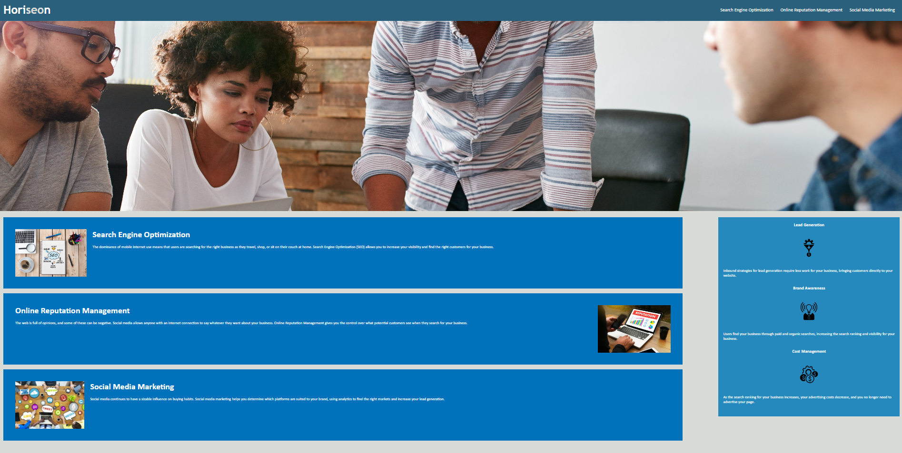

# Horiseon Code

This week our challenge was to refractor code that was already given to us. We began with a page that didn't work completely and code that was repetitive and not complete. 

## What I changed
One of the biggest problems I found with the site was that the Search Engine Optimization button was not working. I realized that it was becuase the CSS style was set to fix the class in which it initially had none. I realized this actually happened a couple of times in the Style.CSS sheet so I made sure that this wasnt the case. The following thing I noticed was that there was a lot of repetition in style.css. So I cleaned up the repetitive code by grouping together all the duplicate styles by either class, div, header, etc. Another thing I noticed in the code was that none of the images had alt tags on them in case the photo wasn't present. So I added alt tags to all of them. Lastly, I noticed that the websit needed a title so I gave it one.  

## What did I learn

In completing this challenge I learned a number of things. One of the things I learned is how important it is to make code a consise as possible. When I first looked at the style sheet there was a lot of repetition that made it very overwhelming to deal with. Once I consolidated the code it was easier to read and a follow. I also learned how important it is to make code easily accessible. It can be very difficult to navigate a page tht doesn't work properly and that can be very frustrating and difficult for a user to navigate through.  

## Screenshot Of My page
